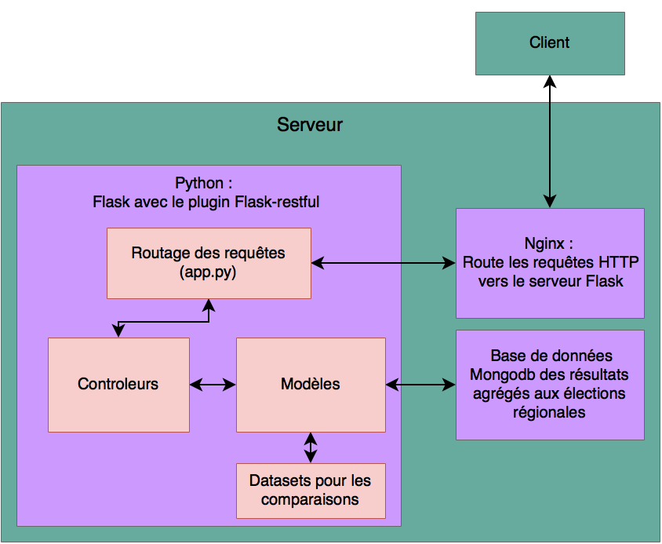
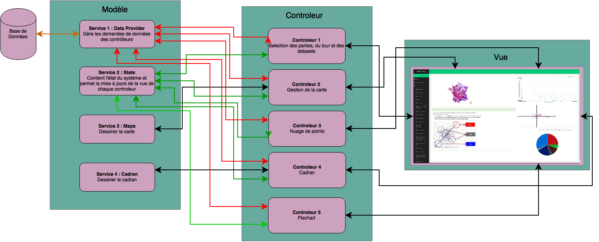

# Ocre
Observation et comparaison des résultats des élections

____

**Table des matières**
- [Démarche pour le projet](#démarche-pour-le-projet)
- [Récupération des différents jeux de données](#récupération-des-différents-jeux-de-données)
	- [Résultats des élections](#résultats-des-élections)
	- [Bases de données gouvernementales](#bases-de-données-gouvernementales)
	- [Fonds de carte](#fonds-de-carte)
- [Traitements opérés](#traitements-opérés)
- [Architecture](#architecture)
- [Technologies utilisées](#technologies-utilisées)
	- [Client (Front-end)](#client-front-end)
	- [Serveur (Back-end)](#serveur-back-end)
- [Installer l'API REST d'Ocre](#installer-lapi-rest-docre)

____

## Démarche pour le projet
Nous avons d'abord souhaité répondre à la demande de l'école de journalisme de Grenoble, pour visualiser et interpréter les résultats des dernières élections (régionales 2015). N'ayant plus eu de contact avec l'école de journalisme nous avons décidé de proposer un outil permettant de comparer les résultats de ces élections, avec un autre jeu de donnée OpenData. Le but étant de proposer un outil qui, dans sa version finale, accèpterait n'importe quel jeu de donnée géolocalisé (suivant une norme) en entrée. Pour comparer ces jeux de donnée, nous proposons de les visualiser en même temps sur une carte de France.
Le rendu final sera la dernière itération éffectuée et ne sera peut être pas identique au projet initial.

Le projet s'est déroulé sur plusieurs phases :
  1. Récupérer les données et générer notre propre base de données
  2. Créer un template et un premier visuel de l'application
  3. Relier la base de données (serveur - back-end) avec l'application (client - front-end)
  4. Afficher plusieurs outils de visualisation
  5. Permettre l'ajout de nouvelles données par le client (extension)

## Récupération des différents jeux de données
### Résultats des élections
Nous avons récupéré les données des élections régionales (premier et second tour) de 2015 en France via un contact de l'école de journalisme de Grenoble. Pour plus de compréhension, il est important de savoir que les différents parties et rassemblements politiques sont définis par un libéllé bien précis :
  - LDIV : Liste Divers
  - LECO : Liste Ecologistes Indépendantes
  - LUDI : Liste Union des Démocrates et
des Indépendants
  - LUG : Liste d'Union de la gauche
  - LCOM : Liste présentée par le PCF hors de l'alliance du Front de gauche
  - LDVG : Liste divers gauche
  - LEXG : Liste d'extrême gauche
  - LRDG : Liste Corse "La Garantie Républicaine"
  - LREG : Liste régionaliste
  - LSOC : Liste du parti socialiste
  - LEXD : Liste d'extrême droite
  - LLR : Liste Les Républicains
  - LMDM : Liste Modem
  - LFN : Liste du Front National
  - LVEC : Liste présentée par Europe Écologie Les Verts
  - LFG : Liste Front de Gauche
  - LUD : Liste Union de la Droite
  - LDVD : Liste divers droite
  - LVEG : liste d'un rassemblement citoyen comprenant Europe Écologie Les Verts, le Parti de gauche (PG) du Front de Gauche, la Nouvelle gauche socialiste (parti composé de dissidents venant du Parti socialiste) et de Nouvelle Donne
  - LDLF : Liste Debout La France

Avec les sources :
  - http://www.localtis.info/cs/BlobServer?blobkey=id&blobnocache=true&blobwhere=1250168333702&blobheader=application%2Fpdf&blobcol=urldata&blobtable=MungoBlobs
  - http://www.senat.fr/senatoriales_2011/liste_des_nuances_politiques_des_candidats_et_des_listes.html
  - http://www.gironde.gouv.fr/content/download/19597/118216/file/GRILLE%20DES%20NUANCES%20POLITIQUES%20DES%20LISTES.pdf

Plusieurs opérations de préparation ont été faites sur ces données car la source n'était pas utilisable en état. Un script a été écrit pour :
- parcourir les tables pour énumérer les entrées redondantes et les remplacer par des références,
- supprimer les entrées inutiles,
- aggréger les données au niveau du département (alors qu'elles étaient au niveau de la commune avant).

### Bases de données gouvernementales
Nous avons utilisé les données de l'INSEE pour pouvoir les confronter aux résultats des élections. Nous avons fait le choix de prendre le taux de nuptialité, de chomage, de natalité et l'évolution des l'emploi en France. Ce sont des données départemantales.

### Fonds de carte
Nous avons récupéré le shapefile des départements français sur le site IGN ([GEOFLA](http://professionnels.ign.fr/geofla)). Nous les avons ensuite converti en geoJSON en changeant le réferentiel pour WGS84) avec [mygeodata converter](http://converter.mygeodata.eu/). Enfin nous les avons simplifiés en éliminant des éléments de géométrie inutiles pour notre utilisation pour gagner en taille (de 8.4 Mo à 370 ko) avec [mapshaper](http://www.mapshaper.org/).

## Traitements opérés
Pour normaliser les données, nous avons utilisée une fonction de la bibliothèque python sklearn, usuellement utilisée pour la fouille de donnée (recentrage et division par la variance).
Ensuite, nous avons fait une régression linaire.

## Architecture
L'Architecture de ce projet est assez simple. Celle du serveur est visible sur le schéma suivant :

Celle du client est présentée sur le schéma qui suit :

## Technologies utilisées
### Client (Front-end)
Au niveau du client, nous avons utilisé les technologies suivantes :
- [AngularJS](https://angularjs.org/) : framework utilisé pour mettre en place un MVC.
- [D3JS](http://d3js.org/) : bibliothèque javascript utilisée pour faire des graphiques (et carte) intéractifs.
- [Angular-nvD3](http://krispo.github.io/angular-nvd3/#/) : Une extension à AngularJS utilisée pour lier les graphiques à notre MVC.
- Un template basé sur [Bootstrap 3](http://getbootstrap.com/) et trouvé sur [binarytheme.com](http://www.binarytheme.com/).

### Serveur (Back-end)
Pour le serveur, nous avons utilisé les technologies suivantes :
- [MongoDB](https://www.mongodb.org/) : Base de donnée NoSQL facile à mettre en place.
- [Python](https://www.python.org/) : Pour réaliser un serveur API REST avec le framework [FLask-RESTful](http://flask-restful-cn.readthedocs.org/en/0.3.4/) et des libraries pour le traitement des données ([sklearn](http://scikit-learn.org/stable/), [numpy](http://www.numpy.org/) et [matplotlib](http://matplotlib.org/)).

## Installer l'API REST d'Ocre
Pour installer l'API REST d'Ocre, suivre les instruction dans le [README de l'API](restful_api/).
